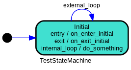

(transitions)=

```{testsetup}

>>> from workflow import Workflow, State

>>> from tests.examples.traffic_light_machine import TrafficLightMachine

```

# Transitions and events

A state machine is typically composed of a set of {ref}`state`, {ref}`transition`, {ref}`event`,
and {ref}`actions`. A state is a representation of the system's current condition or behavior.
A transition represents the change in the system's state in response to an event or condition.
An event is a trigger that causes the system to transition from one state to another, and action
is any side-effect, which is the way a Workflow can cause things to happen in the
outside world.


Consider this traffic light machine as an example:


There're three transitions, one starting from green to yellow, another from
yellow to red, and another from red back to green. All these transitions
are triggered by the same {ref}`event` called `cycle`.

This state machine could be expressed in `python-statemachine` as:

```{literalinclude} ../tests/examples/traffic_light_machine.py
:language: python
:linenos:
:emphasize-lines: 12
:start-at: from workflow
:end-before: "# %%"
```

In line 12, you can say that this code defines three transitions:

* `green.to(yellow)`
* `yellow.to(red)`
* `red.to(green)`

And these transitions are assigned to the {ref}`event` `cycle` defined at the class level.

```{note}

In fact, before the full class body is evaluated, the assigments of transitions are instances of [](workflow.transition_list.TransitionList). When the state machine is evaluated by our custom [metaclass](https://docs.python.org/3/reference/datamodel.html#metaclasses), these names will be transformed into a method that triggers an {ref}`Event`.

```

## Transitions

In an executing state machine, a {ref}`transition` is a transfer from one state to another. In a {ref}`workflow`, a {ref}`transition` tells us what happens when an {ref}`event` occurs.


A transition can define {ref}`actions` that will be executed whenever that transition
is executed.

Transitions can have {ref}`conditions` allowing you to specify when a
transition may be executed.

An action associated with an event (before, on, after), will be assigned to all transitions
bounded that uses the event as trigger.


```{hint}
Usually you don't need to import and use a {ref}`transition` class directly in your code,
one of the most powerful features of this library is how transitions and events can be expressed
linking directly from/to {ref}`state` instances.
```

(self-transition)=

### Self transition

A transition that goes from a state to itself.

Syntax:

```py
>>> draft = State("Draft")

>>> draft.to.itself()
TransitionList([Transition(State('Draft', ...

```

### Internal transition

It's like a {ref}`self transition`.

But in contrast to a self-transition, no entry or exit actions are ever executed as a result of an internal transition.


Syntax:

```py
>>> draft = State("Draft")

>>> draft.to.itself(internal=True)
TransitionList([Transition(State('Draft', ...

```

Example:

```py
>>> class TestWorkflow(Workflow):
...     initial = State(initial=True)
...
...     external_loop = initial.to.itself(on="do_something")
...     internal_loop = initial.to.itself(internal=True, on="do_something")
...
...     def __init__(self):
...         self.calls = []
...         super().__init__()
...
...     def do_something(self):
...         self.calls.append("do_something")
...
...     def on_exit_initial(self):
...         self.calls.append("on_exit_initial")
...
...     def on_enter_initial(self):
...         self.calls.append("on_enter_initial")

```
Usage:

```py
>>> sm = TestWorkflow()

>>> sm._graph().write_png("docs/images/test_state_machine_internal.png")

>>> sm.calls.clear()

>>> sm.external_loop()

>>> sm.calls
['on_exit_initial', 'do_something', 'on_enter_initial']

>>> sm.calls.clear()

>>> sm.internal_loop()

>>> sm.calls
['do_something']

```



```{note}

The internal transition is represented the same way as an entry/exit action, where
the event name is used to describe the transition.

```


## Event

An event is an external signal that something has happened.
They are send to a state machine and allow the state machine to react.

An event starts a {ref}`transition`, which can be thought of as a "cause" that
initiates a change in the state of the system.

In `python-statemachine`, an event is specified as an attribute of the state machine class declaration or directly on the {ref}`event` parameter on a {ref}`transition`.

### Triggering events

Triggering an event on a state machine means invoking or sending a signal, initiating the
process that may result in executing a transition.

This process usually involves

1. checking the current state
1. evaluating any guard conditions
associated with the transition
1. executing any actions associated with the transition and (current and target) states
1. finally updating the current state.

```{seealso}
See {ref}`actions` and {ref}`validators and guards`.
```


You can invoke the event in an imperative syntax:

```py
>>> machine = TrafficLightMachine()

>>> machine.cycle()
Running cycle from green to yellow

>>> machine.current_state.id
'yellow'

```

Or in an event-oriented style, events are `send`:

```py
>>> machine.send("cycle")
Running cycle from yellow to red

>>> machine.current_state.id
'red'

```

You can also pass positional and keyword arguments, that will be propagated
to the actions and guards. In this example, the :code:`TrafficLightMachine` implements
an action that `echoes` back the parameters informed.

```{literalinclude} ../tests/examples/traffic_light_machine.py
    :language: python
    :linenos:
    :emphasize-lines: 10
    :lines: 12-21
```


This action is executed before the transition associated with `cycle` event is activated.
You can raise an exception at this point to stop a transition from completing.

```py
>>> machine.current_state.id
'red'

>>> machine.cycle()
Running cycle from red to green

>>> machine.current_state.id
'green'

```
